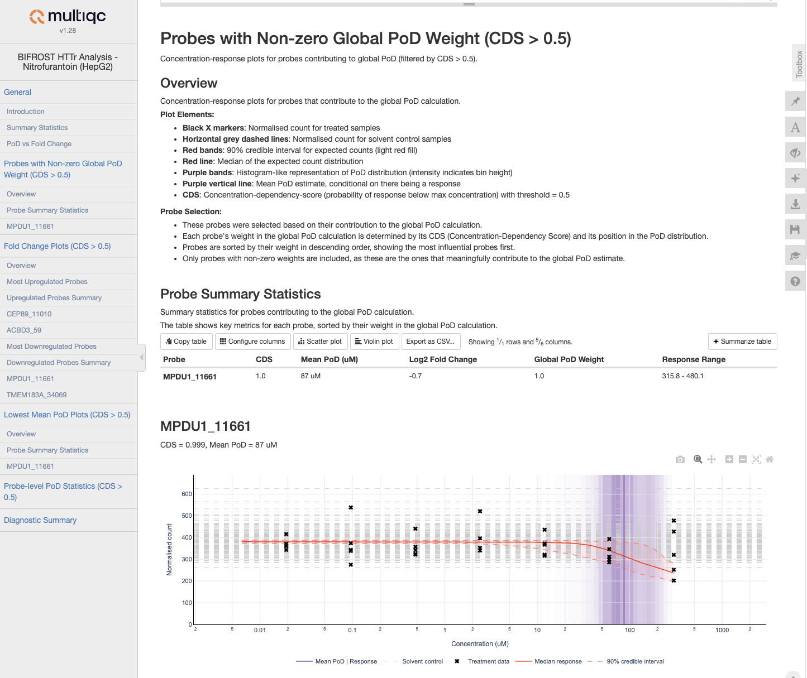

# seqera-services/bifrost

[](https://github.com/seqera-services/bifrost/actions/workflows/nf-test.yml)
[](https://github.com/seqera-services/bifrost/actions/workflows/linting.yml)
[](https://www.nf-test.com)

[](https://www.nextflow.io/)
[](https://github.com/nf-core/tools/releases/tag/3.3.1)
[](https://docs.conda.io/en/latest/)
[](https://www.docker.com/)
[](https://sylabs.io/docs/)

# Bifrost

Bifrost is a Nextflow pipeline for analyzing high-throughput transcriptomics data (HTTr) to identify concentration-dependent responses and estimate points of departure (PoDs).



## Introduction

The Bifrost model (Bayesian inference for region of signal threshold) is a statistical model for analysis of HTTr concentration-response data. The pipeline is powered by [bifrost-httr](https://pypi.org/project/bifrost-httr/), a Python package that implements the core statistical functionality for analyzing concentration-response relationships and inferring points of departure (PoDs). All modules in this pipeline utilize bifrost-httr via Conda environments or Docker containers to perform the analysis steps.

The model is designed to infer a point-of-departure (PoD) from a concentration-response dataset. The PoD is an estimate of the minimum effect concentration of the test substance for the experimental conditions under which the data were produced. PoDs are estimated as probability distributions.

## Usage

> [!NOTE]
> If you are new to Nextflow, please refer to [this page](https://www.nextflow.io/docs/latest/getstarted.html) on how to set-up Nextflow. Make sure to [test your setup](https://www.nextflow.io/docs/latest/getstarted.html#testing-the-installation) with `-profile test` before running the workflow on actual data.

The pipeline accepts two types of input:

1. Raw data input:
```bash
nextflow run bifrost \
   -profile <docker/singularity/.../institute> \
   --input samplesheet.csv \
   --counts counts.csv \
   --meta_mapper meta_mapper.yml \
   --substances_cell_types substances_cell_types.yml \
   --outdir <OUTDIR>
```

2. Pre-prepared JSON input:
```bash
nextflow run bifrost \
   -profile <docker/singularity/.../institute> \
   --input prepared_data.json \
   --outdir <OUTDIR>
```

When using pre-prepared JSON input, the pipeline will skip the data preparation step and process the JSON file(s) directly. You can also mix both types of input to process raw and pre-prepared data in the same run.

For more details and further functionality, please refer to the [usage documentation](docs/usage.md) and the [output documentation](docs/output.md).

## Pipeline output

For more details about the output files and reports, please refer to the [output documentation](docs/output.md). An [example output report](docs/examples/BIFROST_input_Nitrofurantoin_HepaG2_full.html.zip) is available for Nitrofurantoin treatment in HepaG2 cells.

## Credits

Bifrost was originally written by [Joe Reynolds](https://github.com/JoeReynolds257) and [Mark Liddell](https://github.com/mark-liddell).
[Jonathan Manning](https://github.com/pinin4fjords) later updated the workflow structure and migrated to nf-core standards.

## Citations

An extensive list of references for the tools used by the pipeline can be found in the [`CITATIONS.md`](CITATIONS.md) file.
