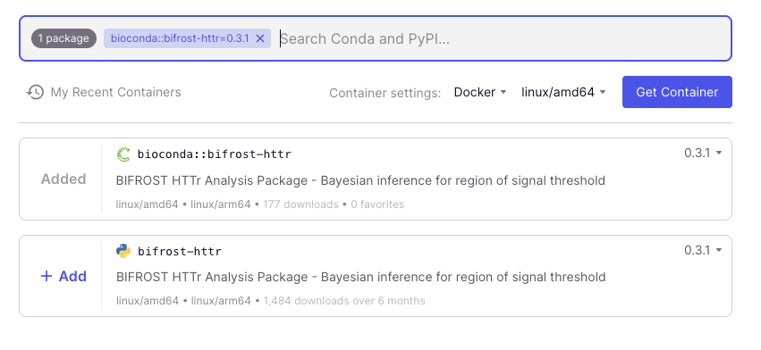
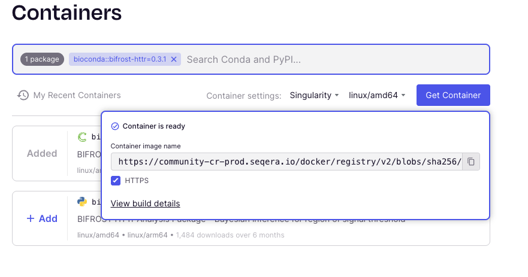

# seqera-services/bifrost: Container Management

## Overview

This guide explains how to create and manage containers for the Bifrost pipeline using Seqera Containers. Seqera Containers provides an easy way to generate both Docker and Singularity container images from Conda packages, which can then be used in Nextflow modules.

## Prerequisites

- Access to [Seqera Containers](https://seqera.io/containers/)
- Understanding of Nextflow module structure
- Basic knowledge of Docker and Singularity containers

## Creating Containers with Seqera Containers

### Step 1: Access Seqera Containers

1. Navigate to [https://seqera.io/containers/](https://seqera.io/containers/)
2. You'll see a search interface for finding packages

### Step 2: Search for the Package

1. Enter `bifrost-httr` into the search box
2. Two entries will appear:
   - One for **PyPI**
   - One for **Conda**
3. **Important**: Always select the **Conda** entry, not the PyPI one



### Step 3: Generate Container URIs

#### For Docker Containers

1. Select the Conda `bifrost-httr` package
2. Choose **Docker** as the container type
3. Click **"Get container"**
4. The Docker URI will be presented immediately (e.g., `community.wave.seqera.io/library/bifrost-httr:0.3.1--b4c49de956618921`)
5. Copy this URI for use in your modules

#### For Singularity Containers

1. Select the Conda `bifrost-httr` package
2. Choose **Singularity** as the container type
3. Click **"Get container"**
4. **Wait for the build to complete** - the container is being built behind the scenes
5. Once ready, you'll see options for the container URI
6. **Important**: Select the **"https"** checkbox to get the HTTPS link instead of the ORAS one
7. Copy the HTTPS URI (e.g., `https://community-cr-prod.seqera.io/docker/registry/v2/blobs/sha256/76/76e8817651...`)



> **Note**: The first time a container is requested, it needs to be built. Subsequent requests will use the cached version and be available immediately.

## Updating Module Files

Once you have both Docker and Singularity URIs, you need to update the module files in the pipeline.

### Module File Structure

Each module in `modules/local/` contains a `main.nf` file with a container declaration that looks like this:

```nextflow
process PROCESS_NAME {
    conda "bifrost-httr=0.3.1"
    container "${ workflow.containerEngine == 'singularity' && !task.ext.singularity_pull_docker_container ?
        'SINGULARITY_HTTPS_URI_HERE' :
        'DOCKER_URI_HERE' }"

    // ... rest of process definition
}
```

### Updating Container URIs

1. **Identify modules to update**: All modules using `bifrost-httr` are located in `modules/local/`:

   - `compile_stan_model/main.nf`
   - `compress_output/main.nf`
   - `conc_response_analysis/main.nf`
   - `create_multiqc_report/main.nf`
   - `prepare_inputs/main.nf`
   - `split_data/main.nf`

2. **Update the container declaration** in each module:

   ```nextflow
   container "${ workflow.containerEngine == 'singularity' && !task.ext.singularity_pull_docker_container ?
       'NEW_SINGULARITY_HTTPS_URI' :
       'NEW_DOCKER_URI' }"
   ```

3. **Replace the URIs**:
   - Replace `NEW_SINGULARITY_HTTPS_URI` with the HTTPS URI from Seqera Containers
   - Replace `NEW_DOCKER_URI` with the Docker URI from Seqera Containers

### Example Update

Before:

```nextflow
container "${ workflow.containerEngine == 'singularity' && !task.ext.singularity_pull_docker_container ?
    'https://community-cr-prod.seqera.io/docker/registry/v2/blobs/sha256/76/76e8817651482fe89237efe5d385050d40144519c9f0c9fc5b0f9ee506292428/data' :
    'community.wave.seqera.io/library/bifrost-httr:0.3.1--b4c49de956618921' }"
```

After (with new URIs):

```nextflow
container "${ workflow.containerEngine == 'singularity' && !task.ext.singularity_pull_docker_container ?
    'https://community-cr-prod.seqera.io/docker/registry/v2/blobs/sha256/ab/ab1234567890abcdef1234567890abcdef1234567890abcdef1234567890abcdef/data' :
    'community.wave.seqera.io/library/bifrost-httr:0.3.2--c5d60ef067729032' }"
```

## Best Practices

1. **Always use the Conda package** when searching in Seqera Containers
2. **Wait for Singularity builds** to complete before copying URIs
3. **Use HTTPS URIs** for Singularity containers, not ORAS URIs
4. **Update all modules consistently** to ensure the same container version across the pipeline
5. **Test the pipeline** after updating container URIs to ensure compatibility
6. **Version control** your changes to track container updates over time

## Troubleshooting

### Container Build Failures

- If a Singularity build fails, wait a few minutes and try again
- Check that you selected the correct Conda package, not PyPI

### Module Errors

- Ensure URIs are copied correctly without extra spaces or characters
- Verify that both Docker and Singularity URIs are updated in the same module
- Check that the Nextflow syntax is valid after the update

### Performance Issues

- New containers may take longer to pull on first use
- Consider pre-pulling containers in production environments

## Additional Resources

- [Seqera Containers Documentation](https://seqera.io/containers/)
- [Nextflow Container Documentation](https://www.nextflow.io/docs/latest/container.html)
- [Docker Documentation](https://docs.docker.com/)
- [Singularity Documentation](https://docs.sylabs.io/)
